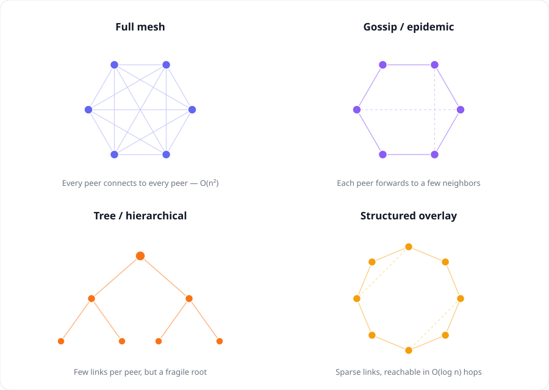

## Motivation

Unlike most of the internet traffic which is client-server, P2P allows endpoints (clients/devices) to talk directly to each other, without a server relaying the communication.

It pays off when:
* Latency between the endpoints are critical (server relay adds overhead) such as real-time communication (voice/video) or gaming.
* Sharing large and reused content (e.g. BitTorrent). P2P saves server side egress bandwidth and can provide much faster transfer speed for well connected clients.
* Decentralization is essential to the product.

:warning: Be careful, however, P2P protocols are rarely needed for common applications. Even collaboration oriented services (e.g. Google Docs) are better served with Websockets. Justifying it requires sufficient **bandwidth or latency payoff** over average usage.

## Essential Details

Do NOT just name drop P2P in system design and propose a solution without understanding the underlying skeleton that makes it work and the challenges around it. Those details show depth and allow one to make better trade-off decisions in a new problem.

### Peer Discovery
The crux, every P2P client needs to learn about its peers before it can connect. Two strategies:
* **Rendezvous point** - some shared location (servers) that peers independently know to connect to and share information. BitTorrent trackers and WebRTC signaling servers are exactly this.
* **Transitive propagation** - no fixed meeting place. Every client shares its known neighbors with others and eventually converge on information. Bitcoin's blockchain does this. More decentralized but still requires fixed seeds to begin with.

### NAT Traversal
The universal pain point. Most people are behind NAT translated public addresses (not for inbound connections) that are NOT uniquely addressable on the internet.

:exploding_head: Here is the trick: **if both sides simultaneously send a packet toward each other, each translation layer sees outbound traffic and opens a temporary path for the return traffic** — even though the return traffic is actually coming from a new peer, not the original destination.

This is how discovered peer info (IP + port) is used. Some gatekeepers can block this, though, in which case we fallback to relaying (TURN servers in WebRTC) for certain applications.

### Connection Protocol
P2P doesn't sit on top of common transport protocols (e.g. TCP), and thus handshake, trust establishment (security), reliability, and congestion control are all custom-built. These are implementation details so I don't deep dive here, but worth knowing the complexity involved in the system. :warning: **P2P network has a big price tag.**

### Topology and Scaling
Worth discussing if propagation latency matters and the network group is large. A typical real-time web app (gaming/voice) will simply fully connect the peers, and meeting services such as Zoom switches to SFU, a lightweight forwarding server that centralizes routing again.

This is general to information propagation and scaling a large group of connected nodes (consensus) rather than a pure P2P concept. Bigger networks like BitTorrent and Blockchain favor a looser topology for scalability, and smaller groups that need fast consistency guarantees will pay for more structure and connected links.
