## Starting Point

In a distributed system, the sharding strategy primarily hinges on **access patterns** and **application requirements**:
* A distributed database typically needs to prioritize query latency and data move efficiency when bringing instances up and down.
* A distributed cache might want frequently accessed data (especially static content) replicated across many instances for read speed when it is not the source of truth and can tolerate eventual consistency.
* Stream or pub-sub systems (e.g. Kafka) that need to guarantee message ordering cannot easily re-shard and thus requiring more deliberation in capacity planning.
* How hot keys/shards emerge varies drastically based on application profile, and the solutions are highly customized.

## Practical Patterns

In a real system design, **often the right way to shard is to NOT shard at all**. Modern hardware is extremely capable with terabytes of RAM and over 100 TB of disk storage in a single instance. This is more than you ever need for most cache layers and even databases. Calculate data volume and latency SLOs realistically to justify the need to shard.

**Almost all real applications that require sharding end up with a hybrid strategy**.

### Hash-based Hybrid Approach
By far the most common sharding pattern is to pick a good partition key (high cardinality, aligns with query shape) and allocate data to a bucket by hashing the key, provided the following challenges are solved (why hybrid):
* **Hot keys** - common in applications that shard by tenant or user (e.g. large client, celebrity). Solutions include:
  * Dedicated nodes for hot keys, dynamically allocated.
  * Divide the hot key further by salting the key (append a random suffix) so it spreads.
* **Query efficiency** - in many database solutions, range queries (e.g. find orders from last week) are very common and need to be answered efficiently. Hashing handles coarse level routing, and data is further partitioned by a monotonically increasing key (e.g. timestamp).
* **Data move** - common in caches, naive approach redistributes data when adding/removing nodes. Solution is to add indirection, see [below](#logical-partitions--directory).

### Logical Partitions + Indirection
"Consistent Hashing" is an industry jargon thrown around when discussing hash-based sharding, but applying it in a real system is more nuanced than a simple magic word. **At its core, the load-baring insight is the decoupling of logical partitions and physical nodes.** A shard is no longer tied directly to a node, instead, it is further mapped by a small indirection layer to physical node(s).

Redis does this in a simple fashion - using a fixed-sized array (~16K entries) for logical partitions and a lookup table (the directory) shared across nodes to handle routing and shard redistribution.

Cassandra's virtual nodes (vnodes) implementation is another example. As a full-fledged database, it also solves other challenges that a lightweight cache never faces:
1. Heterogenous hardware - more vnodes are allocated to beefier instances.
2. Data migration - vnodes allow a node's data to be owned by multiple neighboring nodes, when nodes join or leave, data streaming can be done in parallel.

